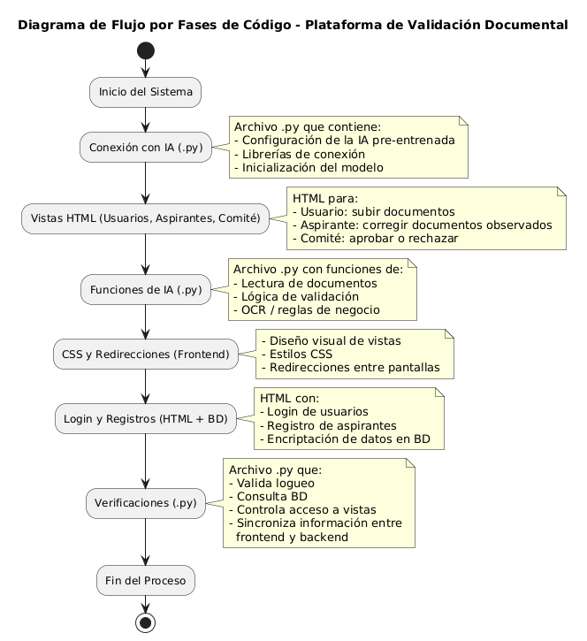

# Hackathon – Backend + Frontend + Chat (IA + OCR)

## 1. 👥 Integrantes del equipo

- Vanesa Alexandra Amaya Bohorquez
- Laura Yulieth López Albino
- Maria Camila Lopez Bernal
- Julian Felipe Peralta Becerra
- Jose Luis Torres Rivera

## 2. 🌐 URL de la aplicación
El proyecto se ejecuta en entorno local:

- Backend → [http://localhost:4000](http://localhost:4000)
- Frontend → [http://localhost:5173](http://localhost:5173)
- Chat (Flask) → según configuración en `chat/README.md`


---

## 3. 📖 Descripción del proyecto
Aplicación web que integra:
- **Backend** con Node.js, Express y PostgreSQL para gestión de usuarios y documentos.  
- **Frontend** con React/Vite para la interfaz de usuario.  
- **Chat** con Flask + IA/OCR (EasyOCR, Tesseract, Ollama) para reconocimiento de texto y conversación inteligente.  

**Librerías principales:**
- Backend: Express, TypeORM, PostgreSQL, Multer, Jest/Hurl (tests).  
- Frontend: React, Vite, React Testing Library/Vitest.  
- Chat: Flask, EasyOCR, Tesseract, Ollama.

---

## 4. 📂 Estructura del proyecto

```bash
├── backend/                  # API Node/Express + TypeORM
│   └── src/
│       ├── app.ts            # punto de entrada backend
│       ├── index.ts          # inicialización servidor
│       ├── passport.ts       # configuración de autenticación
│       ├── seeds.ts          # datos iniciales
│       ├── constants.ts      # constantes globales
│       ├── @Types/           # definiciones de tipos TS
│       ├── config/           # configuración DB
│       │   └── database.ts
│       ├── data/             # datos estáticos
│       │   └── portafolio.json
│       ├── routes/           # rutas de la API
│       │   ├── auth.ts
│       │   └── documents.ts
│       └── services/         # lógica de negocio
│           ├── documents/
│           │   ├── entitiy.ts
│           │   └── schema.ts
│           └── users/
│               ├── entity.ts
│               └── schema.ts
│
├── frontend/                 # React + Vite
│   ├── public/               # recursos estáticos
│   │   ├── docs/             # PDFs de normativa
│   │   ├── images/           # imágenes varias
│   │   └── logos/            # logotipos
│   └── src/
│       ├── App.tsx           # componente raíz
│       ├── main.tsx          # punto de entrada frontend
│       ├── assets/           # recursos gráficos
│       ├── components/       # componentes reutilizables
│       │   ├── IA/           # módulo de documentos con IA
│       │   └── Login/        # login y registro
│       ├── config/           # configuración branding
│       └── pages/            # vistas principales
│           ├── Home.tsx
│           ├── Nosotros.tsx
│           ├── Services.tsx
│           ├── ServiceDetail.tsx
│           ├── Aliados.tsx
│           └── NormativaCuotas.tsx
│
├── chat/                     # Flask + IA/OCR
│   ├── app.py                # aplicación principal Flask
│   ├── auth.py               # autenticación
│   ├── routes/               # rutas Flask
│   │   ├── analizar.py
│   │   └── web.py
│   ├── services/             # lógica IA/OCR
│   │   ├── llm_struct.py
│   │   ├── ocr_ai.py
│   │   ├── utils.py
│   │   └── verificacion.py
│   └── templates/            # vistas HTML
│       └── index.html
│
├── .gitignore
└── README.md

```

---

## 5. 📁 Explicación de carpetas

Perfecto Laura 🙌, aquí te dejo la sección de **explicación de carpetas** ya embellecida en **Markdown**, con íconos y formato jerárquico para que quede profesional y fácil de leer en tu README:

---

## 📁 Explicación de carpetas

### 🖥️ Backend (`backend/src/`)
- **`app.ts` / `index.ts`** → Punto de entrada del servidor Express, inicializa la aplicación.  
- **`passport.ts`** → Configuración de autenticación y estrategias de login.  
- **`constants.ts`** → Variables y constantes globales.  
- **`seeds.ts`** → Datos iniciales para poblar la base de datos.  
- **`@Types/`** → Definiciones de tipos personalizados para TypeScript.  
- **`config/`** → Configuración de la base de datos (TypeORM, credenciales, conexión).  
- **`data/`** → Archivos estáticos como `portafolio.json`.  
- **`routes/`** → Define las rutas de la API:  
  - `auth.ts` → Rutas de autenticación.  
  - `documents.ts` → Rutas de gestión de documentos.  
- **`services/`** → Lógica de negocio y entidades:  
  - `users/` → Entidad y esquema de usuarios.  
  - `documents/` → Entidad y esquema de documentos.  

---

### 🎨 Frontend (`frontend/src/`)
- **`App.tsx` / `main.tsx`** → Punto de entrada de la aplicación React.  
- **`assets/`** → Recursos gráficos (íconos, SVG).  
- **`components/`** → Componentes reutilizables de UI:  
  - `IA/` → Módulo de documentos con integración de IA.  
  - `Login/` → Formularios de login y registro.  
- **`config/`** → Configuración de branding y estilos globales.  
- **`pages/`** → Vistas principales de la aplicación:  
  - `Home.tsx` → Página principal.  
  - `Nosotros.tsx` → Información institucional.  
  - `Services.tsx` → Listado de servicios.  
  - `ServiceDetail.tsx` → Detalle de servicio.  
  - `Aliados.tsx` → Página de aliados estratégicos.  
  - `NormativaCuotas.tsx` → Normativa de cuotas.  

---

### 🤖 Chat (`chat/`)
- **`app.py`** → Aplicación principal Flask.  
- **`auth.py`** → Lógica de autenticación en el microservicio.  
- **`routes/`** → Rutas Flask:  
  - `analizar.py` → Procesamiento de documentos/textos.  
  - `web.py` → Rutas web principales.  
- **`services/`** → Lógica de IA/OCR:  
  - `llm_struct.py` → Integración con modelos de lenguaje (Ollama).  
  - `ocr_ai.py` → Reconocimiento óptico de caracteres (EasyOCR/Tesseract).  
  - `utils.py` → Funciones auxiliares.  
  - `verificacion.py` → Validaciones adicionales.  
- **`templates/`** → Plantillas HTML (ej. `index.html`).
- 
---

## 6. ⚙️ Configuración y entorno
- **Base de datos local:** PostgreSQL en puerto 5432.  
- **Alternancia de DB:**  
  ```bash
  npm run use:xampp   # usar MySQL/XAMPP
  npm run use:sb      # usar Supabase
  ```
- **Archivos de configuración:** `.env` en backend y frontend para credenciales y puertos.

---

## 7. 🚀 Cómo ejecutar el proyecto
1. Clona el repositorio.  
2. Instala dependencias en cada carpeta:  
   ```bash
   cd backend && npm ci
   cd frontend && npm ci
   cd chat && pip install -r requirements.txt
   ```
3. Levanta cada servicio:  
   ```bash
   cd backend && npm run dev
   cd frontend && npm run dev
   cd chat && python app.py
   ```
4. Accede a la aplicación en:  
   - Backend: `http://localhost:4000`  
   - Frontend: `http://localhost:5173`  
   - Chat: según configuración en README de `chat`.

---

## 8. 🔗 Endpoints disponibles

| Feature              | Route                          | Method | Description                         |
|----------------------|--------------------------------|--------|-------------------------------------|
| Registro usuario     | `/api/auth/register`           | POST   | Crear nuevo usuario                 |
| Login                | `/login`                       | POST   | Autenticación y cookie de sesión    |
| Crear documento      | `/api/documents/create`        | POST   | Crear documento asociado a usuario  |
| Subir archivo        | `/api/documents/upload/:docId` | POST   | Subir archivo (rut, cédula, etc.)   |
| Listar archivos      | `/api/documents/files/:docId`  | GET    | Listar archivos de un documento     |
| Actualizar estado    | `/api/documents/status/:id`    | PUT    | Cambiar estado (aprobado/rechazado) |
| Listar documentos    | `/api/documents/all`           | GET    | Obtener todos los documentos        |

---

## 9. 🧪 Pruebas E2E
Se incluyen pruebas de punta a punta con **Hurl**:

- **Auth E2E:**  
  ```bash
  cd backend
  ./run-auth-test.bat   
  ```
  Valida registro, login y errores.

- **Documentos E2E:**  
  ```bash
  cd backend
  ./run-documents-test.bat
  ```
  Valida creación de documento, subida de archivos, listado y actualización de estado.

---

## 10. 🏗️ Arquitectura del proyecto
El sistema sigue una arquitectura **modular**:
- **Backend:** patrón MVC con servicios y entidades en TypeORM.  
- **Frontend:** componentes React + hooks para estado global.  
- **Chat:** microservicio Flask con integración OCR/IA.  

.png>)


